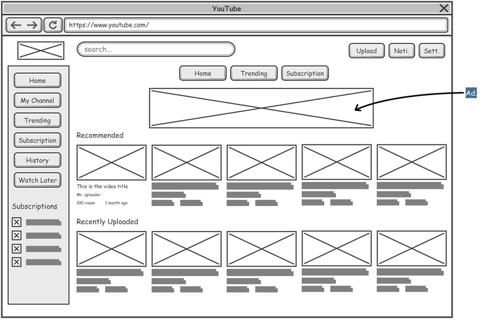

# Projeto de Interface

## User Flow

> 

## Wirefram

**Tela Inicial:**

A tela inicial do site é a porta de entrada para uma experiência centrada em animais, e sua composição reflete essa essência. A paleta de cores rosa coral é cuidadosamente escolhida para transmitir uma sensação de leveza e genuinidade, transparecendo sentimentos de carinho e cuidado. Uma imagem de um  cachorro recebe os visitantes, fornecendo uma visão calorosa e acolhedora para o site. Essa imagem não apenas introduz o tema, mas também desempenha um papel na comodidade visual, aliviando a visão dos usuários e tornando a navegação mais agradável e intrigante. A disposição dos elementos na tela inicial é projetada para proporcionar praticidade e versatilidade na movimentação do usuário, direcionando-o com facilidade ao botão "Começar", que convida os visitantes a explorar o mundo de informações e recursos disponíveis no site, criando uma experiência de usuário envolvente.

 **Tela de Login:**

A tela de login mantém a consistência visual com a paleta de cores rosa coral, estendendo a atmosfera amigável e reconfortante do site a todas as etapas da navegação. Para garantir uma autenticação segura, a estrutura de login é posicionada à direita da tela, proporcionando uma experiência de uso prática e intuitiva. Cada detalhe é cuidadosamente projetado para tornar a navegação fácil e eficiente, desde a disposição dos campos de entrada até as cores dos botões . A consistência visual nessa etapa é de extrema importância, uma vez que permite aos visitantes identificar facilmente os elementos interativos, construindo uma experiência de usuário confiável e coesa, respeitando os padrões de design e segurança.

**Tela de Cadastro:**

A tela de cadastro é composta por elementos adicionais que aprimoram a usabilidade, permitindo aos visitantes fornecer informações essenciais e consentir com o processo de cadastro. Novamente, a consistência visual desempenha um papel fundamental nesse processo, garantindo que o preenchimento do cadastro seja fácil e intuitivo. O site demonstra seu compromisso com a segurança e privacidade dos visitantes ao oferecer informações sobre como os dados serão tratados e protegidos. Nesta etapa, os visitantes também são informados sobre a comunidade de tutores e  animais presentes no site, enfatizando a importância de criar uma rede de contatos segura e confiável. A experiência de cadastro é projetada para ser segura e acolhedora, demonstrando o cuidado e a responsabilidade do site com seus usuários.

São protótipos usados em design de interface para sugerir a estrutura de um site web e seu relacionamentos entre suas páginas. Um wireframe web é uma ilustração semelhante do layout de elementos fundamentais na interface.

### Exemplo

A tela Inicial apresenta um menu lateral com as principais seções do portal, enquanto a navigation bar, ao topo, apresenta informações de envio de imagens ou navegação pela galeria de fotos. A área central apresenta a galeria de fotos na forma de uma grade.

 
> **Links Úteis**:
> - [Protótipos vs Wireframes](https://www.nngroup.com/videos/prototypes-vs-wireframes-ux-projects/)
> - [Ferramentas de Wireframes](https://rockcontent.com/blog/wireframes/)
> - [MarvelApp](https://marvelapp.com/developers/documentation/tutorials/)
> - [Figma](https://www.figma.com/)
> - [Adobe XD](https://www.adobe.com/br/products/xd.html#scroll)
> - [Axure](https://www.axure.com/edu) (Licença Educacional)
> - [InvisionApp](https://www.invisionapp.com/) (Licença Educacional)
